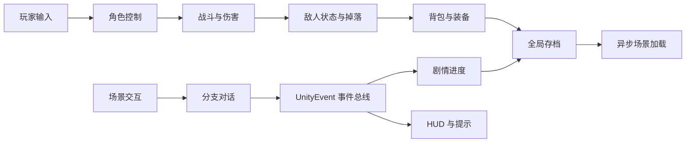

# 异世界 RPG 核心玩法系统

基于 Unity 3D 的第三人称 RPG 核心玩法实现。仓库保留 59 个 C# 脚本、约 6,682 行代码，覆盖角色控制、战斗判定、敌人 AI、背包装备、分支对话、剧情事件、存档和场景切换等相互关联的游戏系统。

> 当前仓库是核心脚本归档，不包含完整 Unity 工程和第三方美术资产，适合用于阅读系统拆分与实现思路，不能直接作为完整游戏运行。

## 核心能力

- **角色与战斗**：第三人称移动、视角控制、普通攻击、闪避、属性成长、受击与死亡反馈。
- **战斗判定**：通过攻击区域检测目标，统一处理伤害、生命值、击杀、经验与掉落流程。
- **敌人 AI**：实现野猪、野兔、士兵等差异化行为，以及 NPC 闲置、巡逻、追击和对话状态。
- **背包与装备**：支持材料、消耗品、武器、护甲分类，以及拾取、装备、金币和属性面板联动。
- **对话与剧情**：使用 `ScriptableObject` 配置分支对话，通过 `UnityEvent` 解耦剧情节点、任务提示与 UI。
- **全局流程**：保存角色属性、背包、装备和剧情进度，并通过异步场景加载管理地图切换。

## 系统关系

## 模块导航

| 模块 | 主要职责 | 代表实现 |
| --- | --- | --- |
| `Player/` | 移动、视角、交互与角色状态 | `PlayerMoveController`、`InteractDetect` |
| `Combat/` | 攻击、伤害、生命值、战斗区域 | 攻击检测、属性与受击组件 |
| `AI/` | 敌人/NPC 状态切换与移动行为 | 野猪、野兔、士兵行为脚本 |
| `Inventory/` | 物品配置、拾取、装备和金币 | `ItemConfig`、背包与装备逻辑 |
| `Dialog/` | 对话数据、展示和选项分支 | `DialogConfig`、对话控制器 |
| `Story/` | 剧情条件、节点推进与任务提示 | 剧情流程和条件组件 |
| `Event/` | 跨系统事件分发 | `GameEventManager` |
| `Global/` | 数据管理、存档和场景加载 | `DataManager`、`SceneLoader` |
| `UI/` | HUD、菜单、物品和剧情反馈 | 血条、背包、提示与菜单组件 |

## 关键流程

### 战斗与掉落

1. 玩家输入驱动移动、攻击或闪避动画。
2. 攻击窗口内使用范围检测获取目标，并由统一属性组件结算伤害。
3. 敌人根据距离和战斗状态在巡逻、追击、攻击、受击、死亡间切换。
4. 死亡事件触发经验、物品掉落及 HUD 更新，避免各模块直接互相依赖。

### 对话与剧情

对话内容和分支以 `ScriptableObject` 配置，展示层只负责渲染文本与选项；选择结果通过事件管理器通知剧情、背包和 UI，使剧情逻辑可以独立于具体场景对象维护。

### 存档与场景

`DataManager` 聚合角色属性、背包/金币/装备和剧情进度，`SceneLoader` 使用 Unity 异步加载接口更新加载界面。原实现采用 `BinaryFormatter` 保存历史数据，该 API 已不适合生产环境；如继续开发，应迁移到 JSON、MessagePack 或受版本控制的自定义序列化方案。

## 恢复完整工程

1. 创建与原脚本 API 兼容的 Unity 3D 工程，并复制 `Assets/Scripts`。
2. 重新配置 Input、Animator、Prefab、Collider、NavMesh、场景和 UI 引用。
3. 创建对话与物品 `ScriptableObject` 数据，并绑定事件监听器。
4. 使用自有或已获授权的模型、材质、贴图、动画和音频资源。
5. 迁移存档实现后，再进行场景联调与构建测试。

## 个人工作与边界

本人主要负责核心玩法与系统脚本的实现和联调，包括角色战斗、敌人 AI、背包装备、分支对话、剧情事件、存档和场景加载。仓库未包含商用/第三方模型、材质、音频、贴图及原始 Unity 工程配置，以尊重资产授权并避免将不可复现内容包装为完整交付物。
